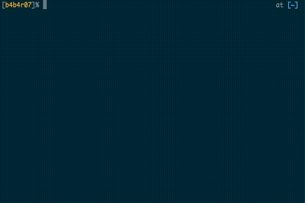

# goal

[][travis]
[][license]
[][release]

[travis]: https://travis-ci.org/b4b4r07/goal
[license]: https://raw.githubusercontent.com/b4b4r07/dotfiles/master/doc/LICENSE-MIT.txt
[release]: https://github.com/b4b4r07/goal/releases

`goal` is a simple `go get` tool which pull all Go packages described in config.toml.

## Description

`goal` is simple `go get` tool. Therefore, it doesn't have management function such as `bundle` because just install or update go packages. 

***DEMO:***



## Features

- **A TOML file**

	It is possible to manage the go package list that you want to install by writing a TOML file such as the following:

	```toml
	repos = [
		"github.com/BurntSushi/toml",
		"github.com/BurntSushi/toml/cmd/tomlv",
		"github.com/b4b4r07/gch",
		"github.com/b4b4r07/go-pipe",
		"github.com/b4b4r07/gomi",
		# ...,
	]
	```

	[TOML](https://github.com/toml-lang/toml) is easier to read and easier to write than [JSON](https://json.org).

- **Faster**

	Fast installation thanks to the parallel processing by goroutine

## Requirements

- go

## Usage

	$ goal [<path/to/config.toml>]

[`repos`](https://github.com/b4b4r07/goal/blob/master/example/config.toml#L1) that are described in `config.toml` will be install or update.

## Installation

### Developer

If you want to go the Go way (install in GOPATH/bin) and just want the command:

	$ go get github.com/b4b4r07/goal

### Otherwise

If you're on OS X and want to use [Homebrew](https://brew.sh):

	$ brew tap b4b4r07/goal
	$ brew install goal

## License

[MIT](https://raw.githubusercontent.com/b4b4r07/dotfiles/master/doc/LICENSE-MIT.txt)

## Author

[BABAROT](http://tellme.tokyo) a.k.a. b4b4r07
